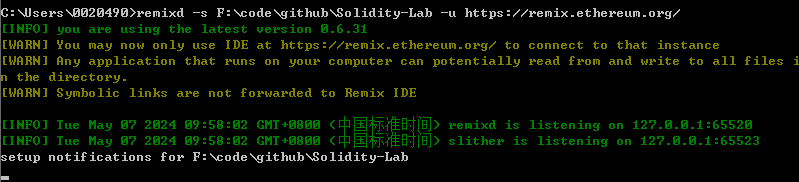
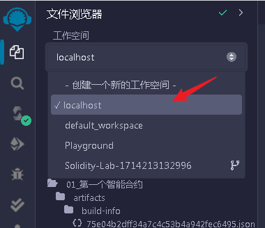

官方参考文档`https://remix-ide.readthedocs.io/zh-cn/latest/remixd.html`

```bash
npm install @remix-project/remixd
```

查看版本 
```bash
remixd -v
```
启动remixd
```bash
remixd -s F:\code\github\Solidity-Lab -u https://remix.ethereum.org/
```


访问remix online页面，切换到本地：

