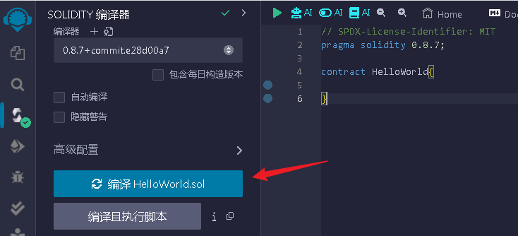

# 第一个智能合约

编写第一个智能合约。

以太网的智能合约都是使用solidtty语言编写，文件以`.sol`为后缀的文件；

## 版本
```
pragma solidity 0.8.7;
```
文件最开头需要定义solidity的版本，通过`pragma Solidity` 进行指定，版本更新比较快，你需要关注各个版本之间的变化和差异，并且选用比较稳定的版本，如：0.8.7

***制定版本通常有以下几种方式：***
- 使用精确版本号：
```
pragma solidity 0.8.10;
```
这会告诉编译器使用精确的 Solidity 版本 0.8.10 进行编译。
- 使用范围版本号：
```
pragma solidity >=0.6.0 <0.9.0;
```
这会告诉编译器在 0.6.0 版本及以上但低于 0.9.0 版本之间选择一个兼容版本进行编译。
- 使用 ^ 符号：
```
pragma solidity ^0.8.0;
```
^ 符号表示选择最新的向后兼容版本，即如果 Solidity 发布了 0.8.10 版本，编译器也会使用它进行编译。

无论你选择哪种写法，都可以确保你的合约在指定的 Solidity 版本下进行编译。选择适当的版本号取决于你的合约所需要的功能和你对 Solidity 版本的偏好。

## SPDX-License-Identifier
`// SPDX-License-Identifier: MIT` 是一个 SPDX 许可证标识符，用于指定合约的许可证信息。SPDX（Software Package Data Exchange）是一个标准化的开源软件许可证信息格式，旨在为软件项目提供清晰的许可证信息。

在 Solidity 合约中，添加 `// SPDX-License-Identifier: MIT` 这样的注释可以指定合约的许可证类型。在这个例子中，`MIT` 是指使用 MIT 许可证，MIT是限制最少的，我们在平常用得最多的也是这个。

这个注释的作用包括：

1. **指定许可证类型**：通过 `SPDX-License-Identifier` 注释，你可以明确指定合约所使用的许可证类型。在这个例子中，使用了 MIT 许可证，它是一种常见的开源软件许可证，允许用户在满足一定条件的情况下使用、修改和分发软件。

2. **提供许可证信息**：在合约的源代码中包含许可证信息可以帮助其他人了解你的代码是如何被许可的，以及他们可以使用、修改和分发代码的方式。这对于开源项目来说是非常重要的，因为它可以提高代码的可信度和可用性。

3. **法律合规**：在一些情况下，法律要求在源代码中包含许可证信息，以确保代码的合法性和合规性。通过在合约中包含许可证信息，可以遵循这些法律要求。

虽然`// SPDX-License-Identifier: MIT` 是可选的，但注释提供了合约的许可证信息，帮助其他人了解和遵守合约的许可条件，同时也为合约的合法性和合规性提供了支持。

## contract

定义一个最简单的智能合约：
```
contract HelloWorld{
    
}
```
`contract`关键字用于定义一个智能合约的开始，这类似于java中的`class`关键之，`HelloWorld`为智能合约的名称。然后使用一对`{}`括起来，在这里编写智能合约的主体内容；

这样我们就完成第一个智能合约的编写啦；

编写完成的合约，还需要进行编译成机器能够执行的二进制文件；

