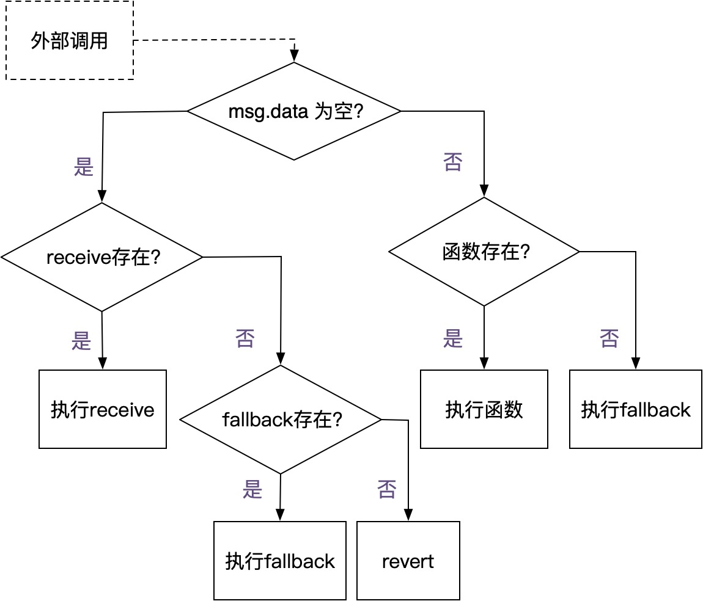

### receive 和 fallback 工作流程

- 当参数 `msg.data` 为空时，就意味着：外部向合约进行转账，存入以太币。
- 当参数 `msg.data` 不为空时，就意味着：外部在调用合约中的函数。
- 我们在左边的分支可以看到，`receive` 和 `fallback` 函数都能够用于接收以太币 ETH。
- 一个智能合约在接收 ETH 时:
    - 如果存在着 `receive` 函数，就会触发 `receive`；
    - 当不存在 `receive` 函数，但存在 `fallback` 函数时，就会触发 `fallback`；
    - 而当两者都不存在时，交易就会 `revert`，存入 ETH 失败。