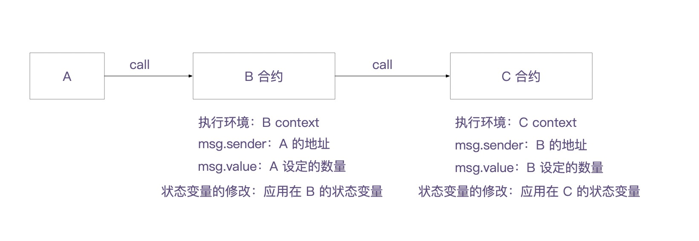
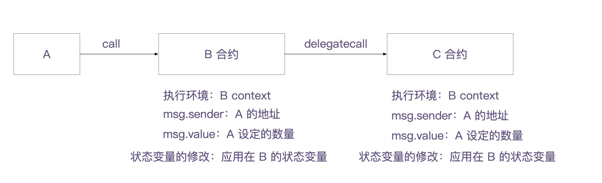

## 1. delegatecall 和 call 对比
### a. call 的工作方式

当外部调用者 A 通过合约 B ，使用 call 方式调用合约 C 的函数时，将会执行合约 C 的函数代码，该函数所处的上下文 `Context` 是合约 C 的上下文。

这里的 `Context` 是指执行中的合约状态和存储环境，

这种调用方式，也就意味着，如果执行的函数改变了一些状态，最后的结果都会保存在合约 C 的状态变量和存储上。

同时，执行函数中的 `msg.sender` 是合约 B 的地址，`msg.value` 也是合约 B 设定的数量。

### b. delegatecall 的工作方式

当外部调用者 A 通过合约 B ，使用 `delegatecall` 方式调用合约 C 的函数时，将会执行合约 C 的函数代码，但该函数所处的上下文 `Context` 仍然是合约 B 的上下文。

也就意味着，如果执行的函数改变了状态，产生的结果都会保存在合约 B 的状态变量和存储上。

同时，执行函数中的 `msg.sender` 是合约 A 的地址，`msg.value` 也是合约 A 设定的数量。

## 2. delegatecall 的使用场景
在智能合约开发中，`delegatecall` 主要用于以下两种场景：

### a. 代理合约
实现代理合约是 `delegatecall` 最常见的用途。在这种模式下，智能合约的存储和逻辑可以实现分离。

代理合约负责存储所有的状态变量（即：存储），逻辑合约负责实现所有业务逻辑（即：代码）。

代理合约会保存一个指向逻辑合约地址的变量，它会把所有的函数调用转发到逻辑合约上。

如果业务逻辑升级的话，可以直接部署一个新的逻辑合约，代理合约只需更改指向逻辑合约的地址即可。

所以，在 `delegatecall` 调用方式下，所有数据保存在代理合约中，所以，升级逻辑合约不会对原有数据造成影响。

 

### b. 库函数重用
`delegatecall` 也被用于实现类似于传统编程中的库函数调用。

通过 `delegatecall`，一个合约可以借用另一个合约的函数，就好像这些函数是在调用合约本身中定义的一样。

这样，开发者可以创建通用的合约库，以减少重复代码，提高代码的复用性和合约的效率。 
